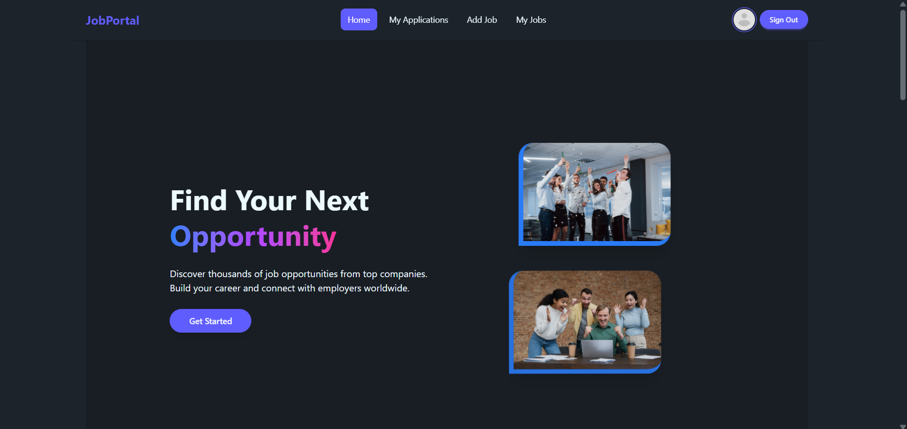
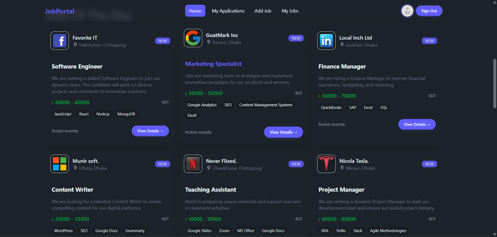
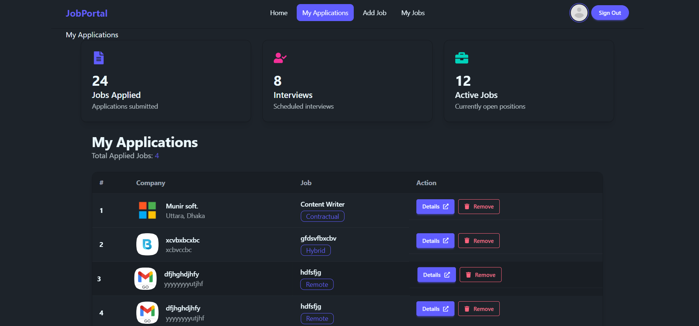
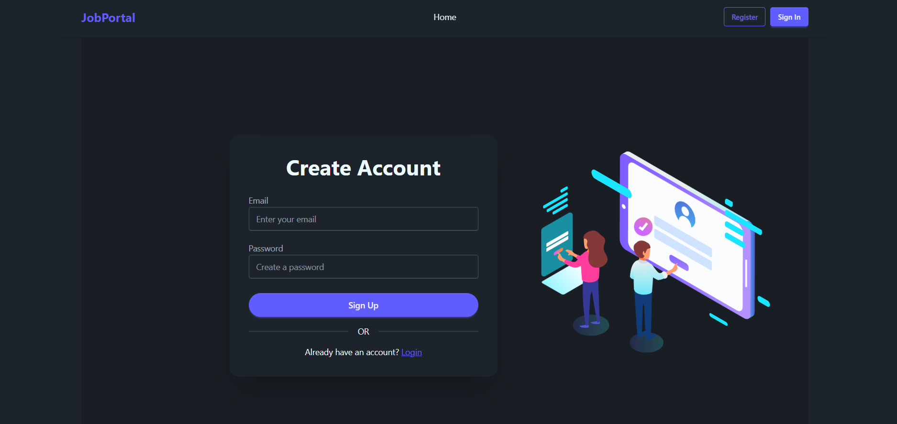
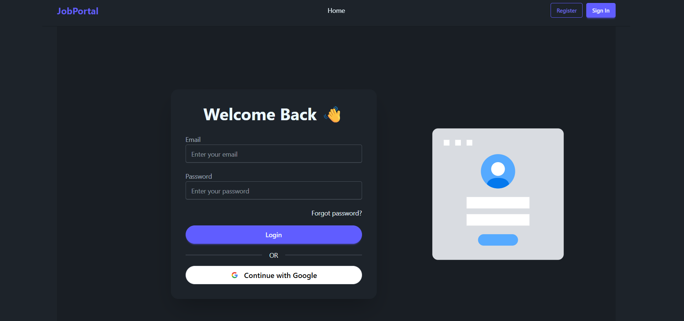
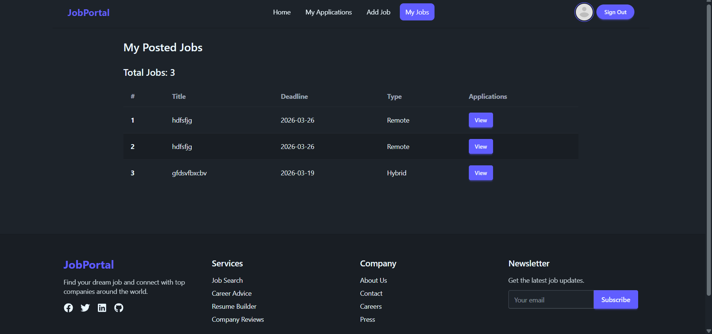
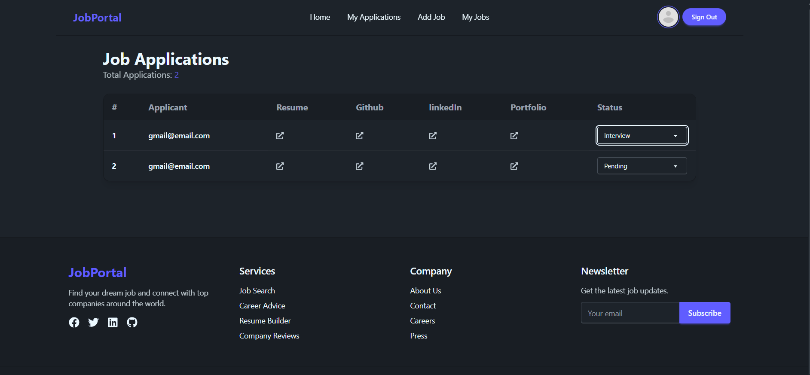
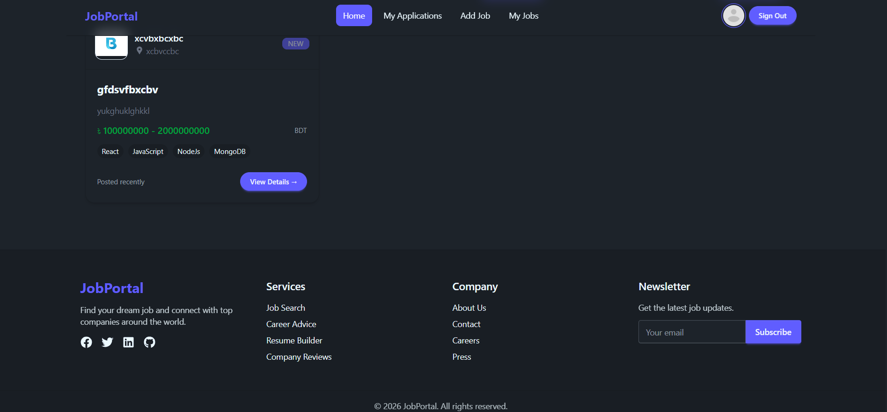

# Job Portal Web Application

## Overview

This is a full-stack Job Portal web application where users can browse jobs, apply for positions, and manage their applications. Recruiters can post jobs and review applicants. The project focuses on authentication, protected routes, and real-time UI updates.

## Live Website

[https://job-portal-11fa2.web.app/](https://job-portal-11fa2.web.app/)

---

## Screenshots

### Landing Page




### Home Page



### My Applications Page



### SignUp Page



### Login Page



### View Applications Page



### Applications status Page



### Footer



---

## Features

* User authentication with Email/Password and Google login
* Secure authentication using JWT and HTTP-only cookies
* Users can apply for jobs
* Users can view and delete their applications
* Recruiters can post jobs
* Protected routes for authenticated users
* Responsive UI for mobile, tablet, and desktop
* Animated UI using Framer Motion
* SweetAlert confirmation for delete actions

---

## Technologies Used

### Frontend

* React
* React Router
* Tailwind CSS
* DaisyUI
* Axios
* Framer Motion
* Lottie React

### Backend

* Node.js
* Express.js
* MongoDB
* JSON Web Token (JWT)
* Cookie Parser

### Authentication

* Firebase Authentication

---

## Installation

### Clone the repository

```
git clone https://github.com/munnabiswas99/job-portal-client.git
```

### Install frontend dependencies

```
cd client
npm install
```

### Install backend dependencies

```
cd server
npm install
```

---

## Environment Variables

Create a `.env` file in the server folder:

```
DB_USER=your_database_user
DB_PASS=your_database_password
JWT_ACCESS_SECRET=your_secret_key
```

---

## Run the Project

### Start backend server

```
npm run start
```

### Start frontend

```
npm run dev
```

---

## Future Improvements

* Job search and filtering
* Pagination
* Application status tracking
* Admin dashboard
* Job Post

---

## Author

Munna Biswas

GitHub: [https://github.com/munnabiswas99](https://github.com/munnabiswas)

---

